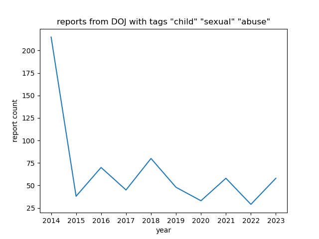
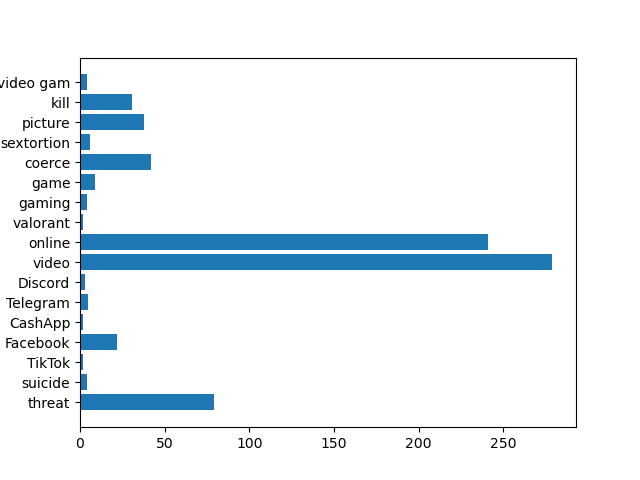

# DOJ Website Scraper

## Overview
This Python script parses the https://www.justice.gov/news site for all articles related to child sexual abuse which are parsed with BeautifulSoup and stored as JSON entities, and combined into a single JSON file. For each Press Release, the following is captured: 
THIS IS ADOPTED AND CHANGED FROM https://github.com/jbencina/dojreleases

## `get_analytics` utility
`get_analytics.py` collects two data points:
1. count of times a a word is mentioned in all of the press releases
2. yearly trends of the number of press releases that have something to do with CSAM

## Master dataframe
1. Title
2. Contents
3. Publish Date

## Scraper Instructions
1. Ensure `BeautifulSoup` and `requests` libraries are installed
2. In your terminal, navigate to whatever directory you cloned the repo in and type in `python scraper.py`

## Examples of analytics it can draw

